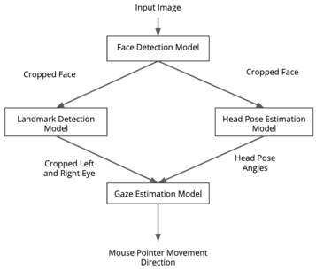
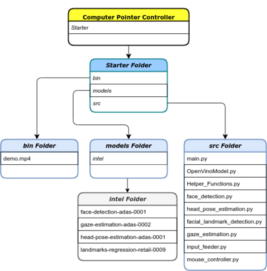
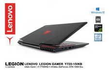
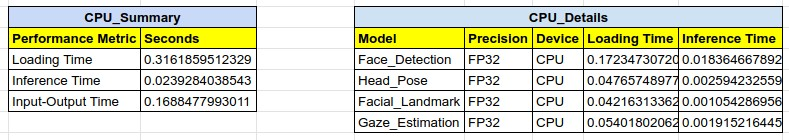
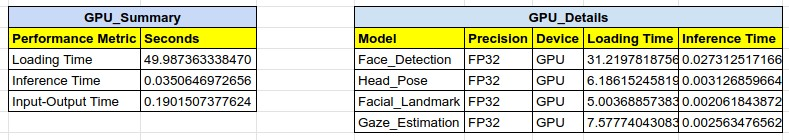
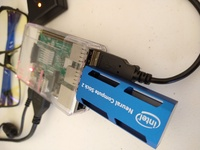

# Computer Pointer Controller

### Introduction

In this project, a gaze detection model is used to control the mouse pointer of your computer. You will be using the Gaze Estimation model to estimate the gaze of the user's eyes and change the mouse pointer position accordingly. This project will demonstrate how multiple models can run in the same machine and coordinate the flow of data between thm to achieve the control of the mouse as mentioned.

### How it works

The InferenceEngine API from Intel's OpenVino ToolKit is used to build the project. The gaze estimation model requires three inputs:

- The head pose
- The left eye image
- The right eye image.

To get these inputs, three other OpenVino models are required:

- Face Detection 
- Head Pose Estimation 
- Facial Landmarks Detection

### The Pipeline

The flow of the data for this project is shown in the following figure, from the input, and then amongst the different models and finally to the mouse controller: 

The implementation of the pipeline considers the input and output shapes of each model. If the shapes or data format are different for a particular model, preprocessing methods are used to adecuate them.

### Project Structure and files

- ***Structure***

- ***Files***

The *bin* folder contains the video for testing the presented code, where an instructor from the Udacity Edge AI nanodegree program making gaze and head movements for the control of the mouse cursor. Furthermore, the *models* folder contains all intel's pre-trained models required for the gaze tracking inference, each of them contains models with different precisions. Lastly, the *src* folder contains all python classes and modules needed for the implementation of the model. More information about each of these files can be seen when opening them. 

## Project Set Up and Installation

#### OpenVino Requirements

- Make sure to make note of the [hardware requirements](https://software.intel.com/content/www/us/en/develop/tools/openvino-toolkit/system-requirements.html) for the Intel® Distribution of OpenVINO™ Toolkit if you want to work locally.

- If you do want to do the exercises on your local machine (or perhaps even on a set-up like a Raspberry Pi with an [Intel® Neural Compute Stick 2.](https://software.intel.com/content/www/us/en/develop/articles/intel-neural-compute-stick-2-and-open-source-openvino-toolkit.html)), you can follow the instructions below for your operating system.

### Installing OpenVino

- OpenVino can be installed in you local machine followinf this [instructions.](https://software.intel.com/content/www/us/en/develop/tools/openvino-toolkit/download.html)

- Instructions for installtion on a raspberry pi device can be found [here.](https://docs.openvinotoolkit.org/latest/openvino_docs_install_guides_installing_openvino_raspbian.html)

### Getting project files:

Clone this repository to get all required files to run the code.

### Python Enviroment

This projects run on Python3. Inbstructions for creating and activating python3 enviroments can be found [here.](https://docs.python.org/3/library/venv.html), Once a new python3 enviroment was created and activated, the required modules can be installed using the following command, from the folder ~Project/starter/:

- pip install -r requirements.txt

### Actuvating the OpenVino enviroment

source ~/opt/intel/openvino/bin/setupvars.sh

### Downloading the required OpenVino pretrained models

- If running on a local computer in order to get the required pre-trained OpenVino model it is required to source the OpenVino variales: source ~/opt/intel/openvino/bin/setupvars.sh

- If running on a Raspberrypi OpenVino installation, the git clone --depth 1 https://github.com/openvinotoolkit/open_model_zoo repository needs to be clone to: ~/opt/intel/openvino/deployment_tools

Next, the following OpenVino pre-trained models are required to run this project, intructions to get then using the OpenVino downloader are also presetned.

***Model to detect the user faces***

- **face-detection-adas-0001** - *python ~/opt/intel/openvino/deployment_tools/open_model_zoo/tools/downloadewr/downloader.py --name face-detection-adas-0001 -o ProjectDirectory/starter/models*

***Model to detect the pose of the user head***

- **head-pose-estimation-adas-0001** - *python ~/opt/intel/openvino/deployment_tools/open_model_zoo/tools/downloadewr/downloader.py --name head-pose-estimation-adas-0001 -o ProjectDirectory/starter/models*

***Model to detect the user eyes***

- **landmarks-regression-retail-0009** - *python ~/opt/intel/openvino/deployment_tools/open_model_zoo/tools/downloadewr/downloader.py --name landmarks-regression-retail-0009 -o ProjectDirectory/starter/models*

***Model to detect determine the gaze of the user***

- **gaze-estimation-adas-0002** - *python ~/opt/intel/openvino/deployment_tools/open_model_zoo/tools/ownloadewr/downloader.py--name gaze-estimation-adas-0002 -o ProjectDirectory/starter/models*

## Demo

This is an example of how to use the provided code

python src/main.py --face_model models/intel/face-detection-adas-0001/FP32/face-detection-adas-0001 --head_model models/intel/head-pose-estimation-adas-0001/FP32/head-pose-estimation-adas-0001 --facial_landmark_model models/intel/landmarks-regression-retail-0009/FP32/landmarks-regression-retail-0009 --gaze_model models/intel/gaze-estimation-adas-0002/FP32/gaze-estimation-adas-0002 -i bin/demo.mp4 -d GPU_GPU_GPU_GPU -o results/ --mouse_speed fast --mouse_precision medium --markers True

## Documentation

The use of the code contained in this project is explained next:

usage: main.py [-h] -fm < FACE_MODEL_PATH > -hm < HEAD_MODEL_PATH > -fldm < FACIAL_LANDMARK_MODEL_PATH > -gzm < GAZE_MODEL_PATH > -i < INPUT_PATH > -o < OUTPUT_PATH> [-spd < MOUSE_SPEED >] [-prcs < MOUSE_PRECISION >] [-l < CPU_EXTENSION_PATH >] [-d < DEVICE_NAME >] [-pf < THRESHOLD_VALUE >] [-mks < MARKER_FLAG >]

***required arguments:***

  - -fm < FACE_MODEL_PATH >, --face_model < FACE_MODEL_PATH >, *Path to the model that will be used to detect faces on specific targets.*
                        
  - -hm < HEAD_MODEL_PATH >, --head_model < HEAD_MODEL_PATH >, *Path to the model that will be used to detect head positions on specific targets.*
                        
  - -fldm < FACIAL_LANDMARK_MODEL_PATH >, --facial_landmark_model < FACIAL_LANDMARK_MODEL_PATH >, *Path to the model that will be used to detect eyes landmarks on specific targets.*
                        
  - -gzm < GAZE_MODEL_PATH >, --gaze_model < GAZE_MODEL_NPATH >, *Path to the model that will be used to detect faces on specific targets.*
                        
  - -i < INPUT_PATH >, --input < INPUT_PATH >, *Path to image or video file input whewre targets of interest are present.*
                        
  - -o < OUTPUT_PATH >, --output < OUTPUT_PATH >, *Path to save the results obtained.*

***optional arguments:***

  - -spd < MOUSE_SPEED, --mouse_speed MOUSE_SPEED, *Speed to which the mouse cursor move per instruction, valid options are: slow, medium, fast.*
  
  - -prcs < MOUSE_PRECISION >, --mouse_precision < MOUSE_PRECISION >, *Amount of precision for the mouse movements, valid options are: low, medium, high.*
  
  - -l < CPU_EXTENSION_PATH >, --cpu_extension < CPU_EXTENSION_PATH >, *Path to layer extension in case it is incompatible with the device architecture.*
  
  - -d < DEVICE_NAME >, --device < DEVICE_NAME >, *Specify the target device to infer on: CPU, GPU, FPGA or MYRIAD is acceptable. In this project, since four models are needed, the devices used shold be defines such as: Device1_Device2_Device3_Device4.*
  
  - -pf < THRESHOLD_VALUE >, --thresh < THRESHOLD_VALUE >, *Probability threshold for detections filtering(0.6 by default)*
  
  - -mks < MARKER_FLAG >, --markers < MARKER_FLAG >, *Flag used to display markers that identify the models used outputssuch as faces, eyes landmarks and head position angles. valid flag values are False and True.*

*TODO:* Include any documentation that users might need to better understand your project code. For instance, this is a good place to explain the command line arguments that your project supports.

## Benchmarks

### CPU (Lenovo Y720 i7-7700HQ)

- *Device*

- *Summary*

### GPU (Lenovo Y720 i7-7700HQ)

- *Device*

- *Summary*

### VPU (Raspberry PI 3B + NCS2)

- *Device*

- *Summary*

*TODO:* Include the benchmark results of running your model on multiple hardwares and multiple model precisions. Your benchmarks can include: model loading time, input/output processing time, model inference time etc.

## Results

As can be observed in the *Benchmarks* section, in terms of speed, the *CPU* devices are faster. They load the model, make predictions and finalize one input-output implementation in smaller times. The second-best device, in term of speed, is the *GPU*, however, the only real difference in terms of performance is the loading times, given that the inference and input-output times the very similar. On the other hand, the *VPU* devices used showed that it is possible to implement the desired task based on them. Nonetheless, its performance let us know that they are not the most suitable devices for this project, at least when only one VPU device is used.

There are many factors that need to be considered to decide which device is better for the implementation of the desired task, for the control of the mouse cursor based on gaze tracking. For example, even when the VPU devices showed that their measured times are far from being the best, it is necessary to consider that only one VPU was used. If one VPU device is used for each of the required tasks, then the performance for that solution should increase highly, especially when considering that all of the can run in parallel. However, the cost of that solution will increase too. Nevertheless, the cost of the four devices plus the cost of the Raspberry pi will be smaller than the device where the CPU and GPU are located. 

When considered the CPU/GPU device used, the Lenovo legion y720, it can be observed its great performance in terms of speed. Nonetheless, it is not a device running at the Edge, and unless more complex tasks will be running at the same time, it is not an efficient solution, since not a lot of resources are used to solve the presented problem.

To be able to conclude which device configuration is the best to solve the presented problem, more devices need to be analyzed. This, to obtain the best benefits from running a device able to give us good results while using a considerable amount of its available resources and with the smallest possible cost. 

